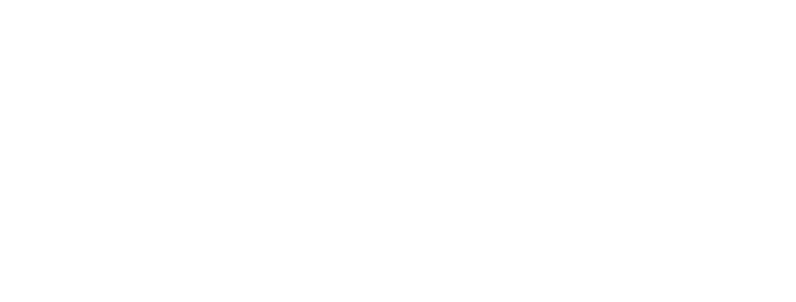

## Tetrython


**Tetrython** is a modern, Python-powered Tetris clone built with `pygame`. It features smooth controls, classic gameplay, hold and ghost pieces, score tracking, and customizable audio — all wrapped in a polished retro-inspired UI.

## 🧩 Features

- ✅ Classic Tetris gameplay
- 🎯 Ghost piece preview for precise drops
- 💾 Score and level tracking with Tetris-style scoring
- 🕹️ Hold system for swapping blocks
- 🖼️ Polished UI
- 🔁 Smooth DAS/ARR input for continuous movement
- 🧱 Wall kick system for tight rotation near walls
- 🚫 Lock delay to prevent accidental piece placements

## 🛠️ Requirements

- Python 3.9+

### Install dependencies:

```bash
pip install pygame
````

## ▶️ How to Run

1. Clone or download this repository.
2. Make sure your working directory has the `assets/` folder.
3. Run the game:

```bash
python tetrython.py
```

## 🎮 Controls

| Key                | Action                |
| ------------------ | --------------------- |
| `← / →` or `A / D` | Move left/right       |
| `↓` or `S`         | Soft drop             |
| `↑` or `W`         | Rotate                |
| `SPACE`            | Hard drop             |
| `C`                | Hold block            |
| `ESC`              | Pause / Resume        |
| `R`                | Retry after game over |


## 💾 High Scores

High scores are saved to:

* `highscore.txt` (single player)

These files are created automatically after the first run.

## 📂 Folder Structure

```
Tetrython/
│
├── assets/
│   ├── Audio/
│   ├── Fonts/
│   └── Images/
├── main.py
├── highscore.txt
├── README.md
└── ...
```

## 🧠 Tips

* Rotate near walls or blocks — wall kicks are supported!
* Clear 4 lines at once (a “Tetris”) for maximum score.
* Level increases every 10 lines and speeds up gameplay.

## 🧑‍💻 Credits
Music by GregorQuendel: https://pixabay.com/music/lullabies-tetris-theme-korobeiniki-rearranged-arr-for-music-box-184978/

---

Have fun playing **Tetrython**! 🎉

